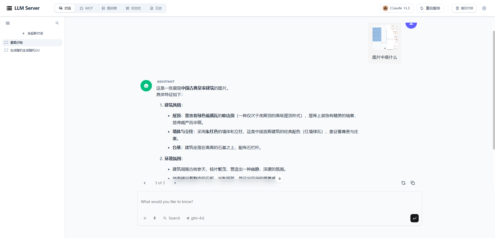
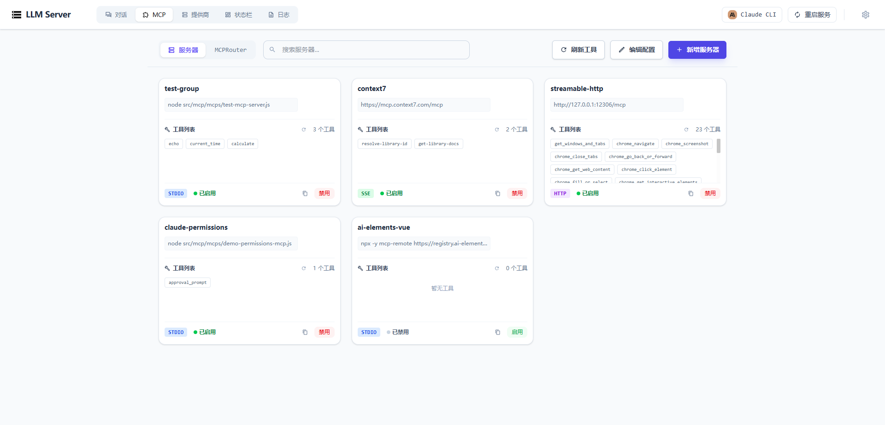
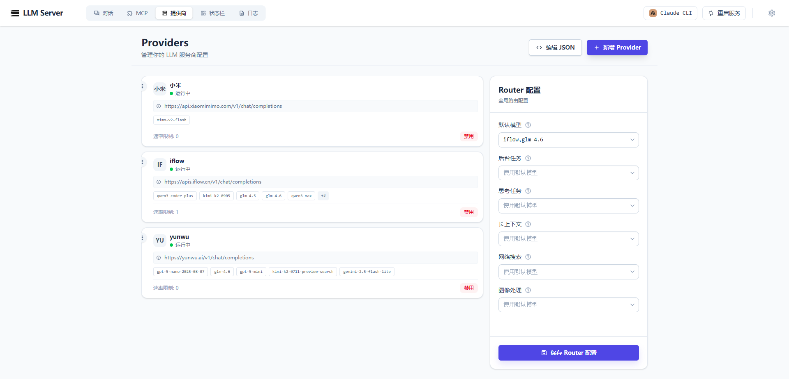
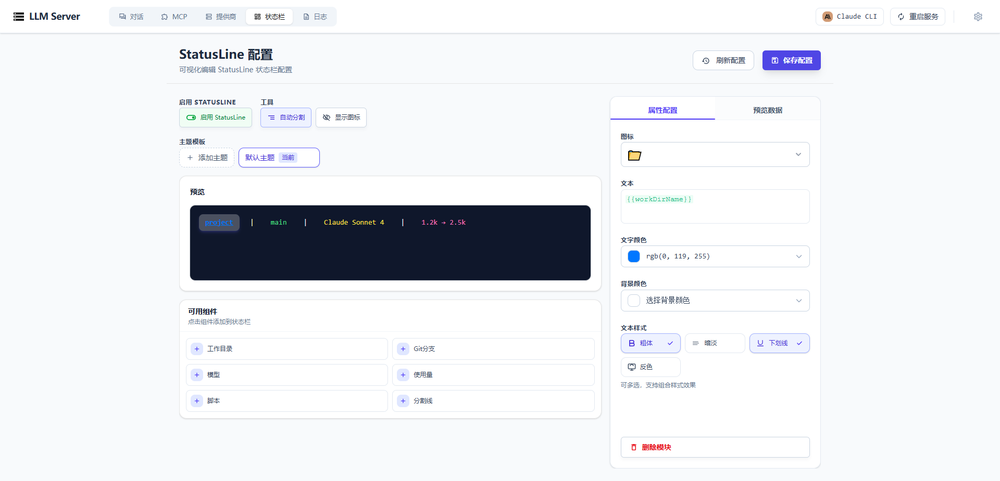
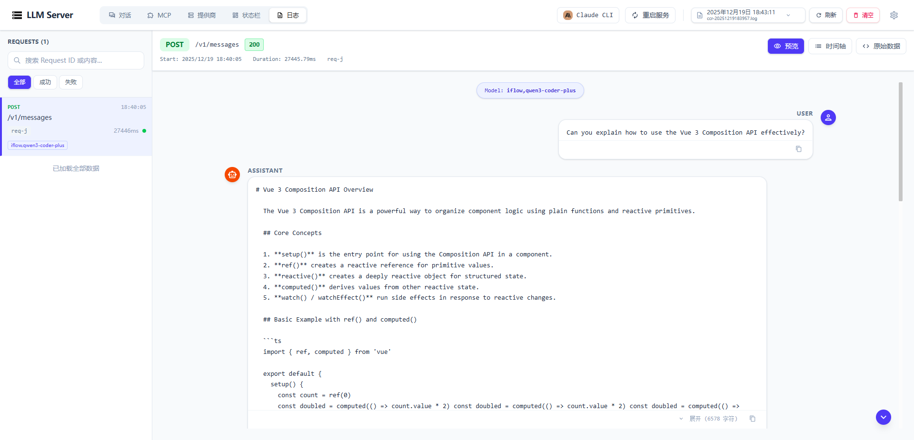

# Naimo Chat

一个现代化的 LLM 聊天与管理平台，支持多提供商、MCP 服务器管理和完整的日志系统。



## 📋 目录

- [项目简介](#项目简介)
- [主要特性](#主要特性)
- [技术栈](#技术栈)
- [项目结构](#项目结构)
- [快速开始](#快速开始)
- [功能说明](#功能说明)
- [配置说明](#配置说明)
- [开发指南](#开发指南)
- [API 文档](#api-文档)

## 项目简介

Naimo Chat 是一个基于 Monorepo 架构的全功能 LLM 管理平台，提供统一的接口来管理和使用多个 LLM 提供商，支持 MCP (Model Context Protocol) 服务器管理，并提供完善的日志记录和监控功能。



## 主要特性

### 💬 对话功能

- 支持流式响应
- 多模型切换
- 对话历史管理
- 实时 Token 计数

### 🔌 提供商管理

- 统一管理多个 LLM 提供商（OpenAI、Claude、Anthropic 等）
- API Key 管理
- 请求限流控制
- 提供商优先级配置



### 🔧 MCP 服务器管理

- 可视化 MCP 服务器配置
- 支持 stdio、HTTP、SSE 传输方式
- 工具调用和管理
- 一键启用/禁用服务器



### 📊 日志系统

- 完整的请求日志记录
- 请求详情查看
- 日志文件管理
- 搜索和过滤功能

### 🎨 状态行配置

- 可视化状态行编辑器
- 主题和样式定制
- 变量支持
- 实时预览



## 技术栈

### 后端

- **Node.js** >= 18.0.0
- **Fastify** - 高性能 Web 框架
- **@musistudio/llms** - LLM 提供商管理
- **@modelcontextprotocol/sdk** - MCP 协议支持

### 前端

- **Vue 3** - 渐进式 JavaScript 框架
- **TypeScript** - 类型安全的 JavaScript
- **Vite** - 下一代前端构建工具
- **Tailwind CSS** - 实用优先的 CSS 框架
- **Monaco Editor** - 代码编辑器
- **Reka UI** - UI 组件库

### 开发工具

- **pnpm** - 快速、节省磁盘空间的包管理器
- **Oxlint/Oxfmt** - 快速代码检查和格式化

## 项目结构

```
naimo_chat/
├── packages/
│   ├── backend/          # 后端服务
│   │   ├── src/
│   │   │   ├── config/   # 配置文件
│   │   │   ├── mcp/      # MCP 服务器管理
│   │   │   ├── middleware/# 中间件
│   │   │   ├── router/   # 路由定义
│   │   │   └── utils/    # 工具函数
│   │   └── doc/          # 文档
│   └── frontend/         # 前端应用
│       ├── src/
│       │   ├── components/# 组件
│       │   ├── views/    # 页面视图
│       │   ├── hooks/    # 组合式函数
│       │   └── stores/   # 状态管理
│       └── public/       # 静态资源
├── scripts/              # 脚本文件
│   └── start-dev.js      # 开发环境启动脚本
├── images/               # 项目图片
└── package.json          # 根 package.json
```

## 快速开始

### 环境要求

- Node.js >= 18.0.0
- pnpm >= 8.0.0

### 安装依赖

```bash
# 安装根依赖和所有子包依赖
pnpm install
```

### 启动开发环境

```bash
# 同时启动前端和后端服务
pnpm dev
```

启动成功后：

- 前端服务：通常运行在 `http://localhost:5173`
- 后端服务：通常运行在 `http://127.0.0.1:3457`

### 单独启动服务

```bash
# 只启动前端
cd packages/frontend
pnpm dev

# 只启动后端
cd packages/backend
pnpm start
```

## 功能说明

### 对话界面

在对话界面中，你可以：

- 选择不同的 LLM 模型进行对话
- 查看实时的流式响应
- 管理对话历史
- 查看 Token 使用情况

### 提供商管理

在提供商管理界面，你可以：

- 添加、编辑、删除 LLM 提供商
- 配置 API Key 和限流设置
- 调整提供商的优先级
- 启用或禁用特定提供商

### MCP 服务器管理

MCP (Model Context Protocol) 服务器管理功能允许你：

- 添加和管理 MCP 服务器配置
- 查看和管理可用工具
- 测试工具调用
- 配置传输方式（stdio/HTTP/SSE）

### 日志查看

日志系统提供：

- 查看所有 API 请求日志
- 查看请求和响应的详细信息
- 搜索和过滤日志
- 管理日志文件

### 状态行配置

状态行编辑器支持：

- 可视化编辑状态行配置
- 添加和配置模块
- 自定义主题和样式
- 实时预览效果

## 配置说明

### 后端配置

后端配置文件位于 `~/.claude-llm/config.json`，包含：

- 提供商配置
- MCP 服务器配置
- 系统设置

### MCP 服务器配置

MCP 服务器配置文件位于 `~/.claude-llm/mcp-servers.json`，格式如下：

```json
{
  "mcpServers": {
    "server-name": {
      "command": "node",
      "args": ["path/to/server.js"],
      "description": "服务器描述",
      "enabled": true
    }
  }
}
```

更多配置说明请参考 [MCP 配置指南](packages/backend/doc/CURSOR_MCP配置指南.md)

### 前端配置

前端配置通过界面进行管理，包括：

- Claude API 设置
- 主题设置
- 其他用户偏好

## 开发指南

### 代码规范

项目使用以下工具进行代码质量保证：

- **Oxlint** - 代码检查
- **Oxfmt** - 代码格式化

```bash
# 检查代码
cd packages/frontend
pnpm lint

# 格式化代码
pnpm format

# 检查并格式化
pnpm lint:format
```

### 构建项目

```bash
# 构建所有包
pnpm build

# 构建特定包
cd packages/frontend
pnpm build
```

### 项目架构

- **Monorepo 架构**：使用 pnpm workspace 管理多个包
- **前后端分离**：前端使用 Vue 3，后端使用 Fastify
- **类型安全**：前端使用 TypeScript
- **模块化设计**：组件和功能模块化，便于维护和扩展

## API 文档

详细的 API 文档请参考 [API_DOCUMENTATION.md](packages/backend/doc/API_DOCUMENTATION.md)

主要 API 端点：

- `GET /api/providers` - 获取所有提供商
- `POST /v1/messages` - 发送消息
- `GET /api/mcp/servers` - 获取 MCP 服务器列表
- `GET /api/logs` - 获取日志列表

## 许可证

本项目为私有项目。

## 贡献

欢迎提交 Issue 和 Pull Request！

## 联系方式

如有问题或建议，请通过 Issue 反馈。
