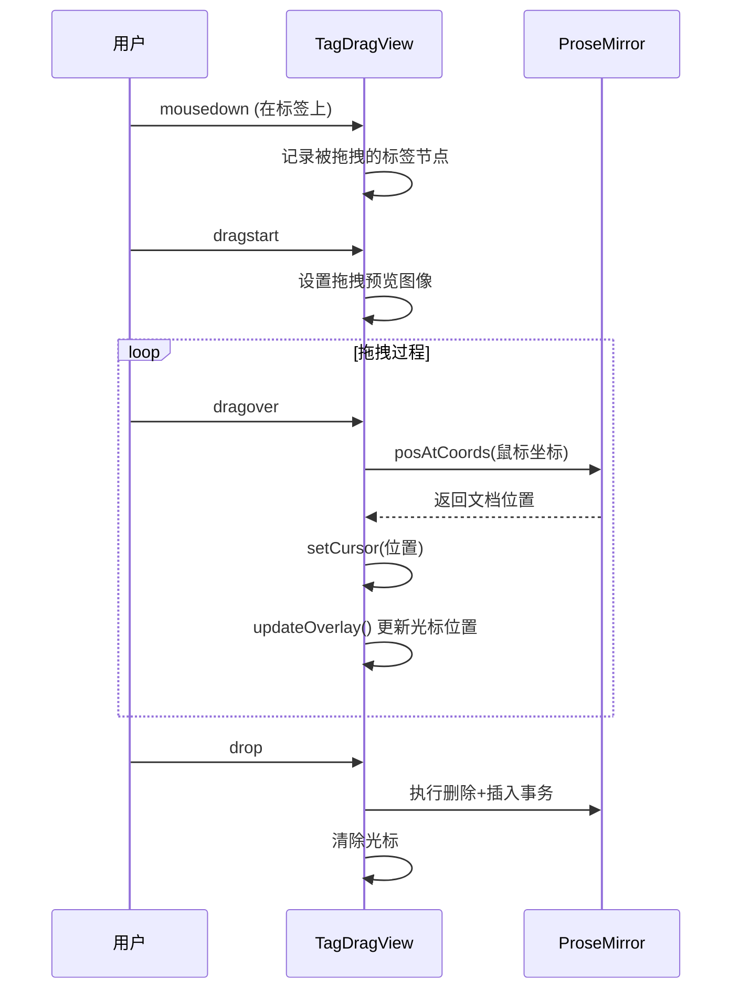

# ProseMirror 标签拖拽功能实现文档

## 概述

本功能实现了在 ProseMirror 编辑器中拖拽标签（Tag）节点并移动到新位置的能力，拖拽过程中会显示一个精确跟随鼠标位置的放置光标。

## 核心技术

### 1. PluginView 模式

参考了官方 `prosemirror-dropcursor` 插件的实现模式，使用 **PluginView** 而非 Decoration 来管理拖放光标：

```typescript
export function createTagDragPlugin(): Plugin {
  return new Plugin({
    key: new PluginKey("tagDrag"),
    view(editorView) {
      return new TagDragView(editorView);
    },
  });
}
```

**优势**：PluginView 可以直接操作 DOM 元素，实现绝对定位的光标，比 Widget Decoration 更精确。

### 2. 光标位置计算

使用 `view.coordsAtPos(pos)` 获取文档位置对应的屏幕像素坐标：

```typescript
const coords = this.editorView.coordsAtPos(this.cursorPos);
```

返回值包含 `left`, `top`, `bottom` 属性，用于精确定位光标元素。

### 3. 坐标转换

将屏幕坐标转换为相对于 `offsetParent` 的位置：

```typescript
// 获取编辑器的 offsetParent
let parent = this.editorView.dom.offsetParent as HTMLElement;

// 计算 parent 的位置偏移
const parentRect = parent.getBoundingClientRect();
parentLeft = parentRect.left - parent.scrollLeft * parentScaleX;
parentTop = parentRect.top - parent.scrollTop * parentScaleY;

// 设置光标位置
this.element.style.left = (coords.left - parentLeft) / scaleX + "px";
this.element.style.top = (coords.top - parentTop) / scaleY + "px";
```

## 拖拽事件流程



## 关键代码说明

### 移动操作（非复制）

```typescript
drop(event: DragEvent) {
  let insertPos = targetPos;
  let deletePos = this.dragTag.startPos;

  // 关键：如果插入位置在原位置之后，需要减去被删除节点的长度
  if (insertPos > deletePos) {
    insertPos -= this.dragTag.node.nodeSize;
  }

  // 先删除原节点，再在新位置插入
  const tr = this.editorView.state.tr
    .delete(deletePos, deletePos + this.dragTag.node.nodeSize)
    .insert(insertPos, this.dragTag.node);

  this.editorView.dispatch(tr);
}
```

### 光标渲染

```typescript
updateOverlay() {
  const coords = this.editorView.coordsAtPos(this.cursorPos);

  this.element.style.left = (coords.left - halfWidth - parentLeft) / scaleX + "px";
  this.element.style.top = (coords.top - parentTop) / scaleY + "px";
  this.element.style.width = width / scaleX + "px";
  this.element.style.height = (coords.bottom - coords.top) / scaleY + "px";
}
```

## 文件结构

| 文件                                                                                                                           | 说明                                            |
| ------------------------------------------------------------------------------------------------------------------------------ | ----------------------------------------------- |
| [prosemirrorSetup.ts](file:///e:/Code/Git/naimo_chat/packages/frontend/src/components/prompt-input/editor/prosemirrorSetup.ts) | `TagDragView` 类和 `createTagDragPlugin()` 函数 |
| [PromptInputEditor.vue](file:///e:/Code/Git/naimo_chat/packages/frontend/src/components/prompt-input/PromptInputEditor.vue)    | 光标样式 `.prosemirror-drop-target`             |

## 参考资料

- [prosemirror-dropcursor](https://github.com/ProseMirror/prosemirror-dropcursor) - 官方放置光标插件
- [ProseMirror Guide](https://prosemirror.net/docs/guide/) - 官方文档
