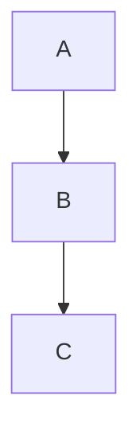

# streamdown-vue

`streamdown-vue` brings [Streamdown](https://github.com/vercel/streamdown)-style streaming Markdown to Vue 3 & Nuxt 3. It ships a `<StreamMarkdown>` component that incrementally renders Markdown as it arrives (token‑by‑token, chunk‑by‑chunk), plus helper utilities to keep partially received text valid.

---

## Table of Contents

1. Features
2. Installation
3. Quick Start (Basic SSR + CSR)
4. Default Styling & Customization
5. Deep Dive Tutorial (Streaming from an AI / SSE source)
6. Props Reference (All `<StreamMarkdown>` props)
7. Component Slots & Overrides
8. Built‑in Components & Data Attributes
9. Security Model (Link/Image hardening)
10. Syntax Highlighting (Shiki), Copy / Download & Extensible Actions
11. Mermaid Diagrams
12. Math & LaTeX Fixes
13. Utilities (`parseBlocks`, `parseIncompleteMarkdown`, LaTeX helpers)
14. Performance Tips
15. Nuxt 3 Usage & SSR Notes
16. Recipe Gallery
17. FAQ
18. Development & Contributing

---

## 1. Features

- GitHub‑flavored Markdown (tables, task lists, strikethrough) via `remark-gfm`
- KaTeX math (`remark-math` + `rehype-katex`) with extra repairs (matrices, stray `$`)
- Shiki syntax highlighting (light + dark themes) with reactive copy & download buttons
  and an extensible action bar (add your own buttons globally or per-instance)
- Mermaid diagrams with caching, async render & graceful error recovery
- Incremental rendering + repair of incomplete Markdown tokens while streaming
- Secure allow‑list based hardening of link & image URLs (blocks `javascript:` etc.)
- Component override layer (swap any tag / embed custom Vue components)
- Data attributes for each semantic element (`data-streamdown="..."`) for styling/testing
- Designed for SSR (Vue / Nuxt) & fast hydration; tree‑shakable, side‑effects minimized

---

## 2. Installation

### Bun

```bash
bun add streamdown-vue
```

### npm / pnpm / yarn

```bash
npm install streamdown-vue
# pnpm add streamdown-vue
# yarn add streamdown-vue
```

You must also install peer deps `vue` (and optionally `typescript`).

Include KaTeX stylesheet once (if you use math):

```ts
import "katex/dist/katex.min.css";
```

---

## 3. Quick Start

`main.ts`:

```ts
import { createApp } from "vue";
import App from "./App.vue";
import "katex/dist/katex.min.css";
createApp(App).mount("#app");
```

`App.vue`:

```vue
<template>
  <StreamMarkdown class="prose" :content="markdown" />
</template>
<script setup lang="ts">
import { StreamMarkdown } from "streamdown-vue";
const markdown = `# Hello\n\nSome *markdown* with $e^{i\\pi}+1=0$.`;
</script>
```

SSR (server) minimal snippet:

```ts
import { renderToString } from "@vue/server-renderer";
import { createSSRApp, h } from "vue";
import { StreamMarkdown } from "streamdown-vue";

const app = createSSRApp({
  render: () => h(StreamMarkdown, { content: "# SSR" }),
});
const html = await renderToString(app);
```

---

## 4. Default Styling & Customization

### Importing the Default Stylesheet

`streamdown-vue` ships with an optional built-in stylesheet that provides clean, neutral, and compact styling for all markdown elements. To use it:

```ts
import "streamdown-vue/style.css";
```

**What's included:**

- Neutral color scheme with automatic dark mode support
- Compact, professional styling for tables and code blocks
- Subtle, transparent scrollbars
- Properly styled buttons, headings, lists, and blockquotes
- Line number styling (when enabled)
- All styles are scoped to `.streamdown-vue` to avoid conflicts

**Example:**

```ts
// main.ts
import { createApp } from "vue";
import App from "./App.vue";
import "streamdown-vue/style.css"; // ← Import default styles
import "katex/dist/katex.min.css";

createApp(App).mount("#app");
```

### Customizing with CSS Variables

All styles use CSS variables prefixed with `--sd-*` that you can override. See the [full list of variables in style.css](./src/style.css).

```css
:root {
  /* Colors */
  --sd-primary: #3b82f6; /* Accent color for links, headings */
  --sd-primary-variant: #2563eb; /* Hover states */
  --sd-on-surface: #1f2937; /* Text color */
  --sd-surface-container: #f3f4f6; /* Code block backgrounds */
  --sd-border-color: #e5e7eb; /* Borders */

  /* Typography */
  --sd-font-family-base: system-ui, sans-serif;
  --sd-font-family-mono: ui-monospace, monospace;
  --sd-font-size-base: 16px;
  --sd-line-height-base: 1.7;

  /* Dimensions */
  --sd-border-width: 1px;
  --sd-border-radius: 0.375rem;
}
```

**Example - Custom Brand Colors:**

```css
:root {
  --sd-primary: #8b5cf6; /* Purple accent */
  --sd-primary-variant: #7c3aed;
}
```

### Dark Mode

Dark mode is automatic via `@media (prefers-color-scheme: dark)` or by adding the `.dark` class to your `<html>` element:

```ts
// Toggle dark mode
const toggleDark = () => {
  document.documentElement.classList.toggle("dark");
};
```

You can customize dark mode colors:

```css
:root.dark {
  --sd-primary: #60a5fa; /* Lighter blue for dark mode */
  --sd-on-surface: #f3f4f6; /* Light text */
  --sd-surface-container: #374151; /* Dark gray backgrounds */
  --sd-border-color: #374151;
}
```

### Completely Custom Styling

If you prefer to write your own styles from scratch, simply **don't import** `streamdown-vue/style.css`. All markdown elements have `data-streamdown` attributes for easy targeting:

```css
/* Your custom styles */
.streamdown-vue [data-streamdown="code-block"] {
  /* Custom code block styling */
}

.streamdown-vue [data-streamdown="table"] {
  /* Custom table styling */
}
```

See section 9 (Built-in Components & Data Attributes) for a complete list of available attributes.

---

## 5. Deep Dive Tutorial – Live Streaming (AI / SSE)

When receiving tokens / partial chunks you typically want to:

1. Append new text chunk into a buffer.
2. Repair the partial Markdown (`parseIncompleteMarkdown`).
3. Split into safe blocks for re-render (`parseBlocks`).
4. Feed the concatenated repaired text to `<StreamMarkdown>`.

Composable example (client side):

```ts
// useStreamedMarkdown.ts
import { ref } from "vue";
import { parseBlocks, parseIncompleteMarkdown } from "streamdown-vue";

export function useStreamedMarkdown() {
  const rawBuffer = ref("");
  const rendered = ref("");
  const blocks = ref<string[]>([]);

  const pushChunk = (text: string) => {
    rawBuffer.value += text;
    // repair incomplete tokens (unclosed **, `, $$, etc.)
    const repaired = parseIncompleteMarkdown(rawBuffer.value);
    blocks.value = parseBlocks(repaired);
    rendered.value = blocks.value.join("");
  };

  return { rawBuffer, rendered, blocks, pushChunk };
}
```

Using Server-Sent Events (SSE):

```ts
const { rendered, pushChunk } = useStreamedMarkdown();
const es = new EventSource("/api/chat");
es.onmessage = (e) => {
  pushChunk(e.data);
};
es.onerror = () => es.close();
```

Template:

```vue
<StreamMarkdown :content="rendered" />
```

Why repair first? Without repair, a trailing `**` or lone ``` will invalidate the final tree and cause flicker or lost highlighting. Repairing keeps intermediate renders stable.

---

## 6. Props Reference

| Prop                       | Type                       | Default                  | Description                                                                                                                                                                     |
| -------------------------- | -------------------------- | ------------------------ | ------------------------------------------------------------------------------------------------------------------------------------------------------------------------------- |
| `content`                  | `string`                   | `''`                     | The full (or partially streamed) markdown source.                                                                                                                               |
| `class` / `className`      | `string`                   | `''`                     | Optional wrapper classes; both accepted (React-style alias).                                                                                                                    |
| `components`               | `Record<string,Component>` | `{}`                     | Map to override built-ins (e.g. `{ p: MyP }`).                                                                                                                                  |
| `remarkPlugins`            | `any[]`                    | `[]`                     | Extra remark plugins. Supports `(plugin)` or `[plugin, options]`. If you supply `remark-math` yourself, the built‑in one (which disables single‑dollar inline math) is skipped. |
| `rehypePlugins`            | `any[]`                    | `[]`                     | Extra rehype plugins.                                                                                                                                                           |
| `defaultOrigin`            | `string?`                  | `undefined`              | Base URL used to resolve relative links/images before allow‑list checks.                                                                                                        |
| `allowedImagePrefixes`     | `string[]`                 | `['https://','http://']` | Allowed (lowercased) URL prefixes for ``. Blocked => image dropped.                                                                                                        |
| `allowedLinkPrefixes`      | `string[]`                 | `['https://','http://']` | Allowed prefixes for `<a href>`. Blocked => link text only.                                                                                                                     |
| `parseIncompleteMarkdown`  | `boolean`                  | `true`                   | (Future toggle) Auto apply repair internally. Currently you repair outside using utility; prop reserved.                                                                        |
| `shikiTheme`               | `ShikiThemeConfig`         | `undefined`              | Shiki theme (string) or dual theme object `{ light: '...', dark: '...' }`. If undefined, follows system preference (`github-light`/`github-dark`).                              |
| `codeBlockActions`         | `Component[]`              | `[]`                     | Array of Vue components appended as action buttons in every code block header.                                                                                                  |
| `codeBlockShowLineNumbers` | `boolean`                  | `false`                  | Show line numbers in all code fences.                                                                                                                                           |
| `codeBlockSelectable`      | `boolean`                  | `true`                   | Whether code text is selectable (adds `select-none` when false).                                                                                                                |
| `codeBlockHideCopy`        | `boolean`                  | `false`                  | Globally hide built‑in copy buttons (you can add your own via actions).                                                                                                         |
| `codeBlockHideDownload`    | `boolean`                  | `false`                  | Globally hide built‑in download buttons.                                                                                                                                        |

All unrecognised props are ignored (no arbitrary HTML injection for safety).

---

## 7. Component Slots & Overrides

`<StreamMarkdown>` does not expose custom slots for content fragments (the pipeline is AST-driven). To customize rendering you override tags via the `components` prop:

```ts
import type { Component } from 'vue';
import { StreamMarkdown } from 'streamdown-vue';

const FancyP: Component = {
    setup(_, { slots }) { return () => h('p', { class: 'text-pink-600 font-serif' }, slots.default?.()); }
};

<StreamMarkdown :components="{ p: FancyP }" :content="md" />
```

If a tag is missing from `components` it falls back to the built-in map.

---

## 8. Built‑in Components & Data Attributes

Each semantic node receives a `data-streamdown="name"` attribute to make styling and querying reliable, even if classes are overridden:

| Element / Component        | Data Attribute      | Notes / Styling Hook                                                   |
| -------------------------- | ------------------- | ---------------------------------------------------------------------- |
| Paragraph `<p>`            | `p`                 | Base text blocks                                                       |
| Anchor `<a>`               | `a`                 | Hardened links (target+rel enforced)                                   |
| Inline code `<code>`       | `inline-code`       | Single backtick spans                                                  |
| Code block wrapper         | `code-block`        | Outer container (header + body)                                        |
| Code block header bar      | `code-block-header` | Holds language label + copy button                                     |
| Code language badge        | `code-lang`         | Language label span                                                    |
| Empty language placeholder | `code-lang-empty`   | Present when no language specified (reserved space)                    |
| Copy button                | `copy-button`       | The actionable copy control                                            |
| Code block body container  | `code-body`         | Wraps highlighted `<pre>`; horizontal scroll applied here              |
| Code block <pre> element   | `pre`               | Added automatically to inner `<pre>` for targeting styles              |
| Code block <code> element  | `code`              | Added automatically to inner `<code>`                                  |
| Code line number span      | `code-line-number`  | Present when line numbers enabled                                      |
| Unordered list `<ul>`      | `ul`                |                                                                        |
| Ordered list `<ol>`        | `ol`                |                                                                        |
| List item `<li>`           | `li`                |                                                                        |
| Horizontal rule `<hr>`     | `hr`                |                                                                        |
| Strong `<strong>`          | `strong`            | Bold emphasis                                                          |
| Emphasis `<em>`            | `em`                | Italic emphasis                                                        |
| Headings `<h1>`–`<h6>`     | `h1` … `h6`         | Each level individually tagged                                         |
| Blockquote `<blockquote>`  | `blockquote`        |                                                                        |
| Table `<table>`            | `table`             | Logical table element                                                  |
| Table wrapper `<div>`      | `table-wrapper`     | Scroll container around table                                          |
| Table head `<thead>`       | `thead`             |                                                                        |
| Table body `<tbody>`       | `tbody`             |                                                                        |
| Table row `<tr>`           | `tr`                |                                                                        |
| Table header cell `<th>`   | `th`                |                                                                        |
| Table data cell `<td>`     | `td`                |                                                                        |
| Image ``              | `img`               | Only if src passes hardening                                           |
| Mermaid wrapper            | `mermaid`           | Replaced with rendered SVG / diagram                                   |
| KaTeX output               | `katex`             | Class emitted by KaTeX (not set by us but styled via global KaTeX CSS) |

### 8.1 Styling via Data Attributes

Because every semantic node has a stable `data-streamdown` marker, you can author zero‑collision styles (or component library themes) without relying on brittle tag chains. Example – customize the code block body and header:

```css
/* Remove borders & add extra bottom padding inside code body */
.message-body :deep([data-streamdown="code-body"]) pre {
  border: none;
  margin-bottom: 0;
  padding-bottom: 30px;
}

/* Header bar tweaks */
.message-body :deep([data-streamdown="code-block-header"]) {
  background: linear-gradient(to right, #f5f5f5, #e8e8e8);
  font-family: ui-monospace, SFMono-Regular, Menlo, monospace;
}

/* Language badge */
.message-body :deep([data-streamdown="code-lang"]) {
  text-transform: uppercase;
  letter-spacing: 0.5px;
}

/* Table wrapper scroll shadows */
.message-body :deep([data-streamdown="table-wrapper"]) {
  position: relative;
}
.message-body :deep([data-streamdown="table-wrapper"]::after) {
  content: "";
  position: absolute;
  top: 0;
  right: 0;
  bottom: 0;
  width: 12px;
  pointer-events: none;
  background: linear-gradient(
    to right,
    rgba(255, 255, 255, 0),
    rgba(0, 0, 0, 0.08)
  );
}
```

Tips:

1. Scope via a parent (e.g. `.message-body`) or component root to avoid leaking styles.
2. Use `:deep()` (Vue SFC) / `::v-deep` where needed to pierce scoped boundaries.
3. Prefer attribute selectors over tag names so overrides survive internal structural changes.
4. For dark mode, pair selectors with media queries or a `.dark` ancestor.

Testing example (Vitest / Bun):

```ts
expect(html).toContain('data-streamdown="inline-code"');
```

---

## 9. Security Model

Only absolute URLs starting with an allowed prefix pass. Steps:

1. Resolve relative (`/x`) against `defaultOrigin` if provided.
2. Lowercase & check `javascript:` scheme (blocked).
3. Check each allowed prefix (case-insensitive).
4. If any fail, the element is dropped (link/text downgraded, image removed).

Example – allow only your CDN images & HTTPS links:

```vue
<StreamMarkdown
  :allowed-link-prefixes="['https://']"
  :allowed-image-prefixes="['https://cdn.example.com/']"
  default-origin="https://example.com"
  :content="md"
/>
```

---

## 10. Syntax Highlighting (Shiki), Copy / Download & Extensible Actions

Code fences are rendered by the internal `CodeBlock` component:

````md
```ts
const x: number = 1;
```
````

Override with your custom block:

```ts
import { defineComponent, h } from 'vue';
import { useShikiHighlighter } from 'streamdown-vue';

const MyCode = defineComponent({
    props: { code: { type: String, required: true }, language: { type: String, default: '' } },
    async setup(props) {
        const highlighter = await useShikiHighlighter();
        const html = highlighter.codeToHtml(props.code, { lang: props.language || 'text', themes: { light: 'github-light', dark: 'github-dark' } });
        return () => h('div', { class: 'my-code', innerHTML: html });
    }
});

<StreamMarkdown :components="{ codeblock: MyCode }" />
```

> **Need a deeper walkthrough?** The [Shiki Language Bundling Guide](./docs/shiki-language-guide.md) covers both the batteries-included entry and the minimal core workflow.

### 10.1 Changing the Shiki Theme

You can switch the built‑in highlighting theme via the `shikiTheme` prop.

**Default Behavior:** If you do not provide a theme, it defaults to `undefined`. This triggers automatic system preference detection:

- `github-light` when the user's system is in light mode
- `github-dark` when the user's system is in dark mode (via `prefers-color-scheme: dark`)

To force a specific theme:

```vue
<StreamMarkdown :content="md" shiki-theme="github-dark" />
```

Any valid Shiki theme name you have available can be passed.

### 10.2 Dual Theme Support (Automatic Theme Switching)

Instead of manually watching theme changes and reactively updating the prop, you can provide both light and dark themes for instant CSS-based theme switching:

```vue
<!-- Dual theme (recommended) - instant switching via CSS -->
<StreamMarkdown
  :shiki-theme="{ light: 'github-light', dark: 'github-dark' }"
  :content="md"
/>
```

When using dual themes:

- Shiki generates CSS variables for both themes in a single render
- Theme switching happens instantly via CSS class changes (no component re-render needed)
- Add/remove `.dark` class on a parent element or rely on `@media (prefers-color-scheme: dark)`
- No need to watch theme changes reactively
- More efficient - eliminates unnecessary re-renders when toggling themes

**Comparison:**

```vue
<!-- Single theme (old approach) - requires reactive updates & re-renders -->
<StreamMarkdown
  :shiki-theme="isDark ? 'github-dark' : 'github-light'"
  :content="md"
/>

<!-- Dual theme (new, recommended) - automatic via CSS -->
<StreamMarkdown
  :shiki-theme="{ light: 'github-light', dark: 'github-dark' }"
  :content="md"
/>
```

The dual theme approach is the recommended pattern for applications with theme switching.

> Note: The default build registers a compact set of common languages (TS/JS/JSON/Bash/Python/Diff/Markdown/Vue/HTML/CSS/Go/Rust/YAML). Add or remove grammars by calling `registerShikiLanguage(s)` before your first render (details below).

### 10.3 Controlling the Shiki bundle

- **`registerDefaultShikiLanguages()`** – invoked automatically when you import from `streamdown-vue`; registers the curated language set.
- **`registerShikiLanguage(s)`** – call this in your own entry point to add or override grammars (local files or CDN-based loaders).
- **`excludeShikiLanguages([...])`** – remove specific loaders after the defaults register (e.g. drop Rust if you never show it).
- **`clearRegisteredShikiLanguages()`** – wipe the registry entirely before registering your own minimal set (used internally by the core entry).
- **`streamdown-vue/core` entry** – ships without defaults so only the grammars you register are ever referenced (perfect for bundle-sensitive apps).

Registering only the languages you need (core build):

```ts
import { StreamMarkdown, registerShikiLanguages } from "streamdown-vue/core";

registerShikiLanguages([
  { id: "typescript", loader: () => import("@shikijs/langs/typescript") },
  { id: "json", loader: () => import("@shikijs/langs/json") },
  { id: "bash", loader: () => import("@shikijs/langs/bash") },
]);
```

The default (non-core) entry automatically registers the curated set listed below. If you only ever highlight a smaller subset, switch to the core entry, register those languages, and your bundler will never even see the unused grammars.

### 10.4 Preloaded Shiki Languages

The built-in highlighter eagerly loads the grammars you register. The default bundle calls `registerDefaultShikiLanguages()` which wires up the following set:

| Canonical ID | Aliases                    | Human-readable language |
| ------------ | -------------------------- | ----------------------- |
| `typescript` | `ts`                       | TypeScript              |
| `tsx`        | —                          | TypeScript JSX          |
| `javascript` | `js`                       | JavaScript              |
| `jsx`        | —                          | JavaScript JSX          |
| `json`       | —                          | JSON                    |
| `bash`       | —                          | Bash / shell script     |
| `shell`      | `shellscript`, `sh`, `zsh` | Generic shell script    |
| `python`     | `py`                       | Python                  |
| `diff`       | —                          | Unified diff            |
| `markdown`   | `md`                       | Markdown                |
| `vue`        | `markdown-vue`             | Vue SFC                 |
| `html`       | `html-derivative`          | HTML / derivatives      |
| `css`        | —                          | CSS                     |
| `go`         | —                          | Go                      |
| `rust`       | —                          | Rust                    |
| `yaml`       | `yml`                      | YAML                    |
| `cpp`        | `c++`                      | C++ _(CDN)_             |
| `java`       | —                          | Java _(CDN)_            |
| `c`          | —                          | C _(CDN)_               |
| `csharp`     | `cs`, `c#`                 | C# _(CDN)_              |
| `php`        | —                          | PHP _(CDN)_             |
| `ruby`       | —                          | Ruby _(CDN)_            |
| `kotlin`     | —                          | Kotlin _(CDN)_          |
| `swift`      | —                          | Swift _(CDN)_           |
| `sql`        | —                          | SQL _(CDN)_             |

If you rarely show, for instance, Rust or Go snippets, simply omit them when calling `registerShikiLanguages`. Fences that reference an unregistered language fall back to plain `<pre><code>` (with a development warning) instead of pulling in extra grammars.

### 10.5 Built‑in CodeBlock Features

`CodeBlock` now provides:

| Feature                    | Prop / Mechanism              | Default | Notes                                                                                  |
| -------------------------- | ----------------------------- | ------- | -------------------------------------------------------------------------------------- |
| Copy button                | `hideCopy` (boolean)          | `false` | Uses Clipboard API; auto‑binds code via context.                                       |
| Download button            | `hideDownload` (boolean)      | `false` | Generates file with inferred extension (lightweight mapping).                          |
| Line numbers               | `showLineNumbers` (boolean)   | `false` | Injects `<span class="code-line-number" data-streamdown="code-line-number">` prefixes. |
| Selectability toggle       | `selectable` (boolean)        | `true`  | Adds `select-none` on `<pre>` when disabled.                                           |
| Per‑block custom actions   | `:actions="[MyBtn]"`          | `[]`    | Array of components/render fns appended right of header.                               |
| Slot actions               | `<template #actions>`         | —       | Slot for ad‑hoc buttons (highest flexibility).                                         |
| Global actions             | App `provide`                 | —       | Provide once: `app.provide(GLOBAL_CODE_BLOCK_ACTIONS, [MyBtn])`.                       |
| Context access for actions | `inject(CODE_BLOCK_META_KEY)` | —       | Retrieve `{ code, language }` without prop drilling.                                   |

### 10.6 Adding Custom Action Buttons (Without Forking)

You normally only use `<StreamMarkdown>`; customize all code blocks via pass‑through props:

```vue
<StreamMarkdown
  :content="md"
  :code-block-actions="[MyShareButton]"
  code-block-show-line-numbers
  code-block-hide-download
/>
```

Or override the internal code block entirely through `components` map (key: `codeblock`):

```ts
const Minimal = defineComponent({
    props: { code: String, language: String },
    setup(p) { return () => h('pre', [h('code', p.code)]) }
});

<StreamMarkdown :components="{ codeblock: Minimal }" :content="md" />
```

Per instance:

```vue
<CodeBlock
  :code="snippet"
  language="ts"
  :actions="[MyShareButton, MyRunButton]"
/>
```

Or via named slot:

```vue
<CodeBlock :code="snippet" language="ts">
    <template #actions>
        <MyShareButton />
        <MyRunButton />
    </template>
</CodeBlock>
```

Globally (main.ts):

```ts
import { GLOBAL_CODE_BLOCK_ACTIONS } from "streamdown-vue";
app.provide(GLOBAL_CODE_BLOCK_ACTIONS, [MyShareButton]);
```

Inside a custom button component you can access the current code & language without props:

```ts
import { defineComponent, inject } from "vue";
import { CODE_BLOCK_META_KEY } from "streamdown-vue";

export const MyShareButton = defineComponent({
  setup() {
    const meta = inject(CODE_BLOCK_META_KEY)!; // { code, language }
    const share = () => navigator.share?.({ text: meta.code });
    return () => <button onClick={share}>Share</button>;
  },
});
```

### 10.7 Hiding Built‑ins

If you want a fully custom action bar:

```vue
<CodeBlock
  :code="snippet"
  language="ts"
  hide-copy
  hide-download
  :actions="[MyShareButton]"
/>
```

### 10.8 Styling Line Numbers

Line numbers render as `<span class="code-line-number" data-line-number data-streamdown="code-line-number">`. Example Tailwind tweaks:

```css
[data-streamdown="code-body"] .code-line-number {
  @apply text-gray-400 dark:text-gray-500 select-none;
}
```

The default copy & download buttons can be selectively hidden while still using custom actions.

The default copy button uses the Clipboard API and toggles an icon for UX; the download button creates a Blob and triggers a synthetic click.

---

## 11. Mermaid Diagrams

Fenced block:

````md

````

The `MermaidBlock` component handles:

- Deduplicated initialization
- Simple hash based caching
- Error fallback (last good diagram)
- Copy diagram source

You can override it via `components` if you need advanced theming.

---

## 12. Math & LaTeX Helpers

### 12.1 Default behavior

`StreamMarkdown` automatically injects `remark-math` + `rehype-katex` _unless you supply your own_ via the `remarkPlugins` prop. The built‑in configuration intentionally sets `singleDollarTextMath: false` so that plain currency like `$390K` or `$80–140K` is **not** misinterpreted as inline math (a common issue during streaming where a later `$` closes a huge unintended span).

Supported by default:

- Display math: `$$ ... $$`
- (If you add them) Inline math via `\( ... \)` or by providing your own `remark-math` with single‑dollar enabled.

### 12.2 Opting into single‑dollar inline math

If you really want `$x + y$` style inline math, provide your own configured plugin tuple. When you do this the built‑in math plugin is skipped:

```ts
import remarkMath from 'remark-math';

<StreamMarkdown
    :content="md"
    :remark-plugins="[[remarkMath, { singleDollarTextMath: true }]]"
/>
```

### 12.3 Optional helper utilities

We still expose some light repair helpers you can (optionally) run yourself before streaming completes:

| Helper              | Purpose (opt‑in)                                                       |
| ------------------- | ---------------------------------------------------------------------- |
| `fixDollarSignMath` | (Optional) Escape truly stray `$` you decide are currency, if desired. |
| `fixMatrix`         | Ensure matrix environments have proper row `\\` line breaks.           |

Example (opt‑in):

```ts
import { fixMatrix, fixDollarSignMath } from "streamdown-vue";

const safe = fixMatrix(fixDollarSignMath(markdown));
```

In streaming scenarios prefer leaving dollar signs untouched; the default config already avoids accidental inline math.

---

## 13. Utilities

### `parseIncompleteMarkdown(text: string)`

Repairs incomplete constructs (unclosed `**`, `_`, `` ` ``, `~~`, `$$` blocks, links/images) so partial buffers still render.

### `parseBlocks(text: string)`

Tokenizes markdown into stable block strings; combining repaired buffer pieces reduces re‑parsing cost vs re‑feeding the whole document each keystroke.

Usage inside a stream loop (see Tutorial above). Both exported from package root.

---

## 14. Performance Tips

- Debounce UI updates: apply repairs & re-render at ~30–60fps (e.g. `requestAnimationFrame`).
- Reuse a single `<StreamMarkdown>` instance; change only `content` prop.
- Avoid running large custom remark/rehype plugins on every partial—they run on full text.
- If highlighting is heavy for enormous fences, lazy-replace code block component after final chunk.
- Use server-side rendering for initial payload to reduce Total Blocking Time.

Benchmarks (see `docs/performance.md`) show ~56ms render of the complex fixture under Bun (subject to change).

---

## 15. Nuxt 3 Usage & SSR Notes

This section shows end‑to‑end integration in a Nuxt 3 project: installation, global registration, a streaming composable, and a server route that emits incremental Markdown.

### 15.1 Install

```bash
npm i streamdown-vue
# or: bun add streamdown-vue
```

### 15.2 Add a Client Plugin (Shiki + KaTeX)

Create `plugins/streamdown.client.ts` (client only so Shiki & Mermaid load in browser):

```ts
// plugins/streamdown.client.ts
import "katex/dist/katex.min.css"; // once globally
// (Optional) warm the Shiki highlighter so first code block is instant
import { useShikiHighlighter } from "streamdown-vue";
useShikiHighlighter();
```

Nuxt auto‑registers anything in `plugins/`. No manual config required unless you disabled auto import.

### 15.3 Basic Page Usage

```vue
<!-- pages/index.vue -->
<template>
  <div class="prose mx-auto p-6">
    <StreamMarkdown :content="md" />
  </div>
  <footer class="text-xs opacity-60 mt-8">Rendered with streamdown-vue</footer>
</template>
<script setup lang="ts">
import { StreamMarkdown } from "streamdown-vue";
const md =
  "# Welcome to Nuxt\\n\\nThis **Markdown** is rendered *streamdown style*.";
</script>
```

### 15.4 Global Component (Optional)

If you prefer auto‑import without explicit import each time, add an alias export file:

```ts
// components/StreamMarkdown.client.ts
export { StreamMarkdown as default } from "streamdown-vue";
```

Now `<StreamMarkdown />` is available automatically (Nuxt scans `components/`).

### 15.5 Secure Link / Image Allow‑Lists

In any page/component:

```vue
<StreamMarkdown
  :content="md"
  :allowed-link-prefixes="['https://', '/']"
  :allowed-image-prefixes="['https://cdn.myapp.com/']"
  default-origin="https://myapp.com"
/>
```

Relative links (e.g. `/about`) will resolve against `defaultOrigin` then be validated.

### 15.6 Streaming From a Server Route (SSE Style)

Create a route that emits partial Markdown pieces:

```ts
// server/api/chat.get.ts
export default defineEventHandler(async (event) => {
  const encoder = new TextEncoder();
  const parts = [
    "# Chat Log\n",
    "\nHello **world",
    "** from",
    " streamed",
    " markdown.",
  ];
  const stream = new ReadableStream({
    start(controller) {
      let i = 0;
      const tick = () => {
        if (i < parts.length) {
          controller.enqueue(encoder.encode(parts[i++]));
          setTimeout(tick, 300);
        } else controller.close();
      };
      tick();
    },
  });
  setHeader(event, "Content-Type", "text/plain; charset=utf-8");
  return stream; // Nuxt will send as a stream
});
```

### 15.7 Client Composable to Consume Streaming Markdown

```ts
// composables/useStreamedMarkdown.ts
import { ref } from "vue";
import { parseBlocks, parseIncompleteMarkdown } from "streamdown-vue";

export function useStreamedMarkdown(url: string) {
  const rendered = ref("");
  const raw = ref("");

  const start = async () => {
    const res = await fetch(url);
    const reader = res.body!.getReader();
    let buf = "";
    const decoder = new TextDecoder();
    while (true) {
      const { value, done } = await reader.read();
      if (done) break;
      buf += decoder.decode(value, { stream: true });
      // repair, split, join
      const repaired = parseIncompleteMarkdown(buf);
      rendered.value = parseBlocks(repaired).join("");
      raw.value = buf;
    }
  };

  return { rendered, raw, start };
}
```

### 15.8 Streaming Page Example

```vue
<!-- pages/stream.vue -->
<template>
  <button @click="start" class="border px-3 py-1 mb-4">Start Stream</button>
  <StreamMarkdown :content="rendered" class="prose" />
</template>
<script setup lang="ts">
import { StreamMarkdown } from "streamdown-vue";
import { useStreamedMarkdown } from "@/composables/useStreamedMarkdown";
const { rendered, start } = useStreamedMarkdown("/api/chat");
</script>
```

### 15.9 SSR Caveats

- The stream loop runs only client-side; on first SSR render you may want a placeholder skeleton.
- Shiki highlighting of large code blocks happens client-side; if you need critical highlighted code for SEO, pre-process the markdown on the server and send the HTML (future enhancement: server highlight hook).
- Ensure Mermaid is only executed client-side (the provided plugin pattern handles this since the component executes render logic on mount).

### 15.10 Troubleshooting

| Symptom                            | Fix                                                                                                                          |
| ---------------------------------- | ---------------------------------------------------------------------------------------------------------------------------- |
| Copy / Download button not showing | Ensure default `CodeBlock` not overridden or your custom block renders desired buttons (remove `hideCopy` / `hideDownload`). |
| Links stripped                     | Adjust `allowed-link-prefixes` / set `default-origin` to resolve relative paths first.                                       |
| Images missing                     | Add CDN prefix to `allowed-image-prefixes`.                                                                                  |
| Flash of unstyled math             | Confirm KaTeX CSS loaded in client plugin before first render.                                                               |
| High CPU on huge streams           | Throttle updates (wrap repair/render in `requestAnimationFrame` or batch by char count).                                     |

That’s it—Nuxt integration is essentially drop‑in plus an optional streaming composable.

---

## 16. Recipe Gallery

| Goal                                  | Snippet                                                     |
| ------------------------------------- | ----------------------------------------------------------- |
| AI Chat                               | Combine streaming buffer + `<StreamMarkdown>` (tutorial §4) |
| Restrict to CDN images                | Set `:allowed-image-prefixes`                               |
| Override `<table>` style              | `:components="{ table: MyTable }"`                          |
| Add custom remark plugin              | `:remark-plugins="[myRemark]"`                              |
| Append footer paragraph automatically | remark plugin injecting node                                |
| Basic local Vue example               | See `examples/basic` in repo                                |

Custom remark plugin skeleton:

```ts
const remarkAppend = () => (tree: any) => {
    tree.children.push({ type: 'paragraph', children: [{ type: 'text', value: 'Tail note.' }] });
};
<StreamMarkdown :remark-plugins="[remarkAppend]" />
```

---

## 17. FAQ

**Why repair outside instead of inside the component?** Control & transparency. You can decide when to re-render; the component focuses on a deterministic AST transform.

**Can I disable KaTeX or Mermaid?** For now they are bundled if you use their fences. Future option could allow toggling; PRs welcome.

**Does it sanitize HTML?** Inline HTML is not allowed (passed through remark/rehype with `allowDangerousHtml: false`). Add a sanitizer plugin if you purposely enable raw HTML.

**Dark mode highlighting?** Use the dual theme format: `:shiki-theme="{ light: 'github-light', dark: 'github-dark' }"` for instant CSS-based theme switching without re-renders, or pass a single theme string for traditional reactive theme switching.

---

## 18. Development & Contributing

```bash
bun install
bun test          # run tests (fast)
bun run build     # build library (types + bundles)
```

PRs for: improved matrix handling, plugin toggles, directive support, performance instrumentation are appreciated.

---

## License

[](LICENSE)

Licensed under the Apache License, Version 2.0.

---

### At a Glance – Minimal Streaming Loop

```ts
let buffer = "";
for await (const chunk of stream) {
  buffer += chunk;
  buffer = parseIncompleteMarkdown(buffer);
  const blocks = parseBlocks(buffer);
  state.markdown = blocks.join("");
}
```

Happy streaming! 🚀
